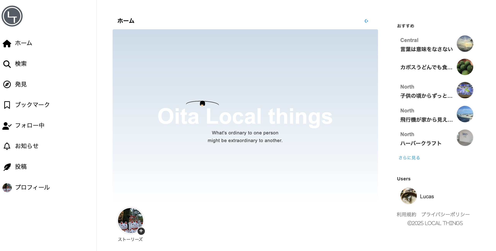
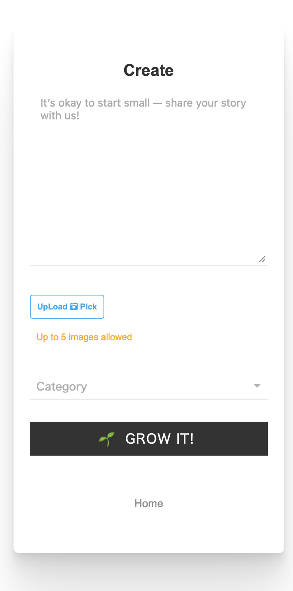
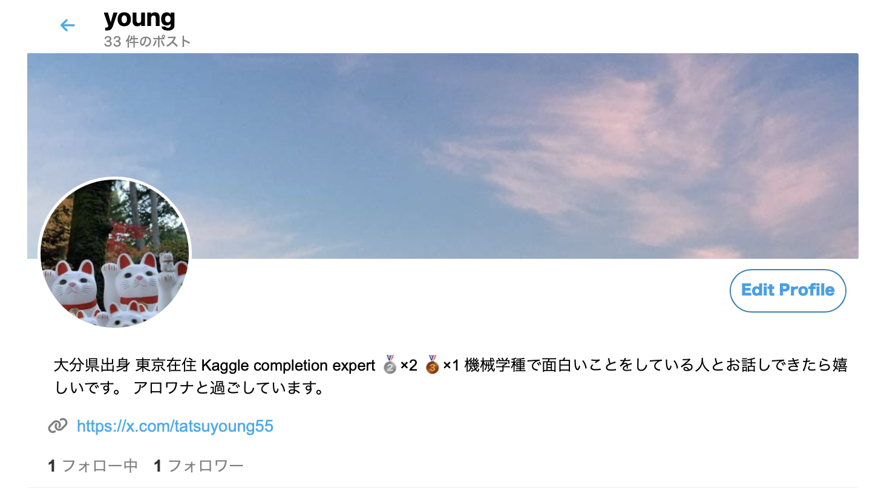

<div align="center">

# 🌏 Local Things
### “あなたの地元を、世界とつなぐSNS”


🚀 **Live Demo:** [localthings.herokuapp.com](https://localthings.herokuapp.com)

</div>

---

## 🏠 Overview

**Local Things** は、「地元愛を世界に広げる」ための地域SNSプラットフォームです。  
投稿・コメント・フォロー・通知・PWA対応など、SNSの主要機能をすべて搭載。  
都道府県ごとにクローン・カスタマイズ可能な “Base SNS” として設計されています。

> 💬 「地元の人とつながりたい」「地域の魅力を発信したい」  
> そんな想いを持つ人たちのための、国産SNSプロジェクトです。

---

## ✨ Main Features

| カテゴリ | 機能内容 |
|-----------|-----------|
| 👤 **ユーザー管理** | ログイン・新規登録・プロフィール編集 |
| 📝 **投稿機能** | 記事投稿・画像添付・編集・削除 |
| 💬 **交流機能** | コメント・いいね・ブックマーク |
| 🔔 **通知機能** | コメント・フォロー・いいね時にバッジ通知 |
| 🌈 **UI / UX** | ダークモード、PWA対応、背景変更、進捗バー |
| 🖼 **メディア対応** | 画像リサイズ、自動サムネイル |
| 🌍 **SNS連携** | Twitterカード / Facebookシェア対応 |
| 🧭 **拡張性** | 地域別にクローン・テーマ変更可 |
| 🧰 **セキュリティ** | カスタム403/404/500ページ・環境変数管理 |

---

## 🛠️ Tech Stack

| カテゴリ | 使用技術 |
|-----------|-----------|
| **Language** | Python 3.11, HTML5, CSS3, JavaScript, jQuery, Ajax |
| **Framework** | Django 4.2.22 |
| **Hosting** | Heroku |
| **Storage** | AWS S3 |
| **Database** | PostgreSQL |
| **OAuth** | Google 認証対応 |
| **Infra** | .env 管理, DEBUG切替, PWA 対応 |

---

## 🧩 Quick Start

```bash
# 1. Clone the repository
git clone https://github.com/tatsuyoung/localthings.git
cd localthings

# 2. Setup environment
cp .env.example .env

# 3. Install dependencies
pip install -r requirements.txt

# 4. Run migrations
python manage.py migrate

# 5. Start the server
python manage.py runserver

```
---

### 💡 開発・本番環境に応じて .env の値を設定してください。
詳細は .env.example を参照。<br>

⚙️ Environment Variables (.env) <br>
| 変数名	| 説明 |
|-------------|-------------|
|DEBUG|	デバッグモード (True / False)
|SECRET_KEY|	Djangoのシークレットキー
|DATABASE_URL|	PostgreSQL接続URL or sqlite3
|EMAIL_HOST_USER / EMAIL_HOST_PASSWORD|	Gmail送信設定
|AWS_ACCESS_KEY_ID / AWS_SECRET_ACCESS_KEY|	AWS S3アップロード用キー
|SOCIAL_AUTH_GOOGLE_OAUTH2_KEY / _SECRET|	Google OAuth認証
|SOCIAL_AUTH_TWITTER_KEY / _SECRET|	Twitter OAuth認証

### 🧠 Project Vision

「地元SNS」を全国に広げる。  
住んでいる人、離れて暮らす人、これから訪れる人、  
みんなが交流できる新しい“地域プラットフォーム”を目指しています。

🌟 **展望**

- 各地域に合わせて自由にカスタマイズ可能  
- 地域経済を支えるマーケットプレイス連携  
- イベント・特産品・観光情報の一元化  
- 他地域SNSとのネットワーク連携  

---

### 📸 Screenshots

| ホーム画面 | 投稿ページ | プロフィール |
|-------------|-------------|---------------|
|  |  |  |

📷 ※UIイメージ。実際のアプリは [Herokuデモ](https://localthings.herokuapp.com/) から確認できます。
---

⚠️ **注意事項（Heroku/Ecoプラン向け）**

現在、アプリは Heroku の Eco・Basic プランで動作しています。  
- 同時に複数人がログインすると、データベース接続制限によりエラーが発生する場合があります  
- 小規模なテスト・個人利用向けとしてご利用ください  
- 本番規模での利用や多数ユーザーを想定する場合は、Herokuの上位有料プランへの切替を推奨します
[HEROKU](https://jp.heroku.com/pricing)
---

### 🌍 For Developers

あなたの地域版SNSを作りませんか？

```bash
# 例: Fukuoka Local Things
git clone https://github.com/tatsuyoung/localthings.git fukuoka-localthings
```
🤝 Contributing

貢献・改善提案を歓迎します！ <br>
	1.	Fork this repository  <br>
	2.	Create a feature branch (feature/your-idea) <br>
	3.	Commit your changes <br>
	4.	Open a Pull Request 🚀

⸻

### 🧭 Roadmap  

✅ SNS基本機能（投稿・フォロー・通知）<br>
✅ PWA対応<br>
✅ ダークモード

🟩 API化（Django REST Framework）<br>
🟩 マーケットプレイス機能<br>
🟩 各都道府県展開（Base SNS拡張）

⸻

### 🌟 Support

もし気に入っていただけたら、Star ⭐️ をお願いします！<br>
このプロジェクトが地域と人をつなぐ力になります。

Starするだけでも応援になります 🙏<br>
👉 GitHubでStarする

⸻

### 📬 Author
### [X](https://x.com/tatsuyoung55)

---

<div align="center">

## 💖 Support Local Things

Local Things は、地域と世界をつなぐオープンソースSNSプロジェクトです。  
あなたの支援が、より良い地域プラットフォームづくりを後押しします 🌏

[](https://github.com/sponsors/tatsuyoung)

> 💬 *“あなたの応援が、地域の未来を動かします。”*  

---

### 🙏 Ways to Support

⭐️ このリポジトリにスターをつける<br>
🩷 [GitHub Sponsors](https://github.com/sponsors/tatsuyoung) で支援する  
🐦 プロジェクトをSNSで紹介する  
🧑‍💻 Issue や Pull Request に参加する  

---
</div>